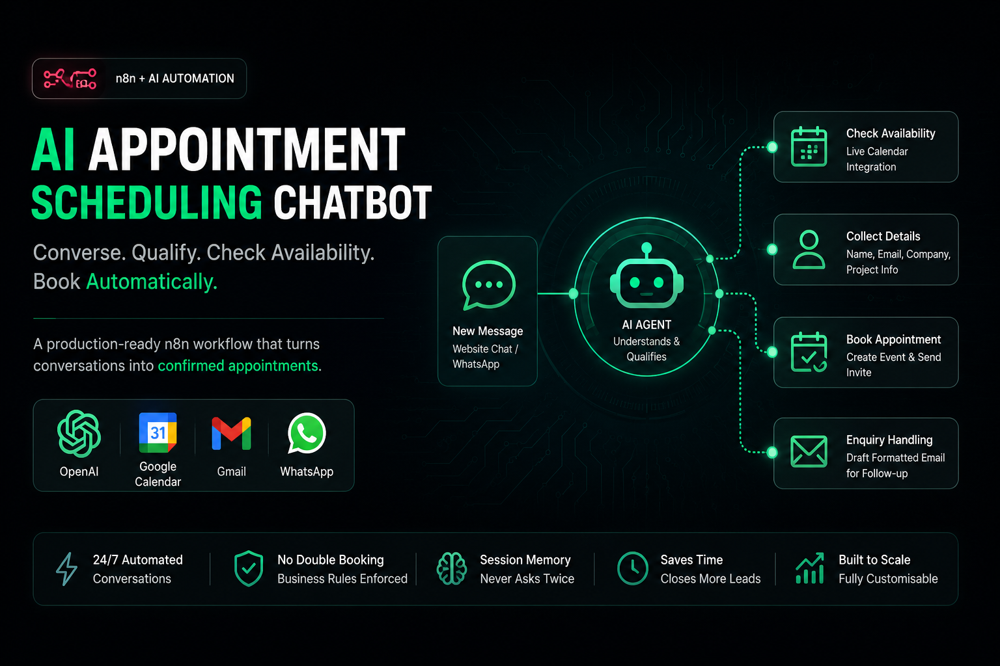
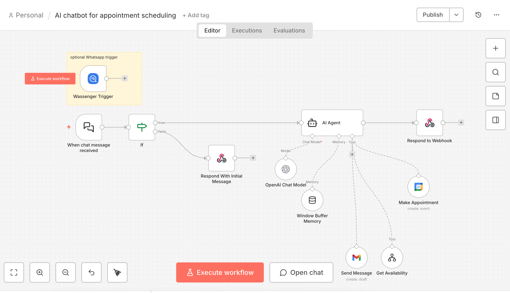
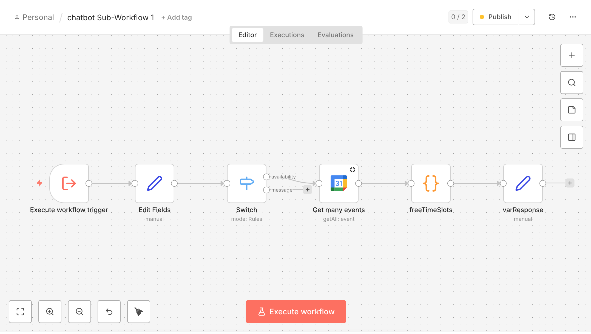

# AI Appointment Scheduling Chatbot — n8n Workflow

> Conversational AI that chats with website visitors, checks live calendar availability, books appointments automatically, and handles enquiries — built as a reusable, fully customisable template.

This is one of the automation systems I build for clients at **Ibn Bilal Automations**. I'm sharing it publicly as a working example of what a production-grade n8n AI agent looks like under the hood.

If you need something like this — or something more complex — built for your business, [get in touch](#-lets-work-together).

---

## 📽️ Demo

🎥 **See it in action:** [Watch the demo](https://loom.com/share/your-link-here)

---

## 💡 What This Solves

Every service business loses leads to slow response times and manual scheduling back-and-forth. This workflow replaces that entire process with a polished AI assistant that:

- Greets visitors and understands what they need
- Checks real-time calendar availability
- Collects their details and books a meeting — instantly, 24/7
- Drafts a formatted email for your team when the visitor isn't ready to book

No forms. No waiting. No manual scheduling.

---

## ✅ What It Does

1. **Receives messages** from a website chat widget or WhatsApp and opens a natural conversation
2. **Qualifies the visitor** — understands their need before suggesting a time
3. **Checks live availability** via a sub-workflow that reads the calendar and computes precise free slots
4. **Enforces business rules** — business hours only, no double booking, 48-hour advance notice
5. **Collects contact details** — name, company, email, and project summary
6. **Books the appointment** on Google Calendar and sends a calendar invite to the customer
7. **Falls back gracefully** — if the visitor isn't ready, composes a detailed HTML Gmail draft for follow-up
8. **Remembers the conversation** — session memory means it never asks the same question twice

---

## 🏗️ Architecture

This template ships as two linked workflows — import the sub-workflow first so n8n can resolve the link automatically.

**Main Workflow** handles the conversation, AI reasoning, calendar booking, and Gmail drafting.

**Sub-Workflow** is called as a tool by the AI agent whenever it needs to check availability. It fetches the next 14 days of calendar events, runs a JavaScript engine to compute free time blocks, and returns clean available slots back to the agent.

This separation keeps each workflow focused, independently testable, and easy to extend.

---

## 🛠️ Stack

| Tool | Role |
|------|------|
| **n8n** | Workflow automation engine |
| **OpenAI GPT-4o Mini** | Conversational AI agent |
| **Google Calendar** | Live availability check + booking |
| **Gmail** | Formatted enquiry drafts |
| **Wassenger** | WhatsApp trigger (optional) |

Compatible with any OpenAI-format LLM — Groq, Mistral, Together AI, Anthropic, or local Ollama.

---

## ⚙️ Setup

### 1 — Import the Workflows
Import `chatbot_Sub-Workflow_1.json` first, then `AI_chatbot_for_appointment_scheduling.json`.

### 2 — Connect Credentials
Add the following in n8n → Credentials:
- **Google Calendar** — OAuth, used in both workflows
- **Gmail** — OAuth, used for enquiry drafts
- **OpenAI** — API key, used by the AI agent
- **Wassenger** *(optional)* — only needed for WhatsApp

### 3 — Personalise the Agent
Open the **AI Agent** node and update the system prompt:
- Your name and business name
- Your timezone (default is PKT / Asia/Karachi)
- Your business hours and advance notice window
- Your service description and consultation type

### 4 — Point to Your Calendar
Select your Google Calendar in both the `Make Appointment` node (main workflow) and `Get many events` node (sub-workflow). Both must point to the same calendar.

### 5 — Test It
Click **Test Workflow**, open the built-in chat widget, and book a test appointment. Confirm it appears in your calendar.

---

## 🎛️ What Can Be Customised

This template is a starting point, not a finished product. In a real client build I typically adapt:

- **Industry and tone** — clinic, law firm, agency, coach, consultant — the prompt changes, the logic stays
- **Intake questions** — budget, project type, team size, anything needed to qualify the lead
- **Appointment duration** — 15, 30, 45, or 60 minutes
- **Multi-calendar support** — routing to different team members based on enquiry type
- **CRM integration** — pushing confirmed bookings to HubSpot, Notion, Airtable, or a Google Sheet
- **Payment-first flows** — requiring Stripe payment before a slot is confirmed
- **Notification layer** — Slack or WhatsApp alerts to the team on every new booking

If what you need doesn't fit the template, that's exactly when you should [reach out](#-lets-work-together).

---

## 🤝 Let's Work Together

I build AI agents, automation pipelines, and workflow systems for businesses that want to stop doing things manually.

This chatbot is one example. I've also built lead generation pipelines, document processing systems, internal ops tools, and multi-agent workflows — using n8n and whatever AI stack fits the use case.

If you have a process that's eating your team's time, I can probably automate it.

**Hamza Abid — Founder, Ibn Bilal Automations**

| | |
|--|--|
| 📧 Email | ibnbilal313@gmail.com |
| 💬 WhatsApp | +923274067546 |
| 💼 LinkedIn | [Hamza Abid](https://www.linkedin.com/in/hamza-abid-kemu) |

*Available for freelance projects, agency partnerships, and full-time roles in automation and AI engineering.*

---

## 📄 License

- ✅ Personal and commercial use allowed
- ❌ Resale of this template as-is is not permitted

---

*Built with n8n · OpenAI · Google Calendar · Gmail · Wassenger*
